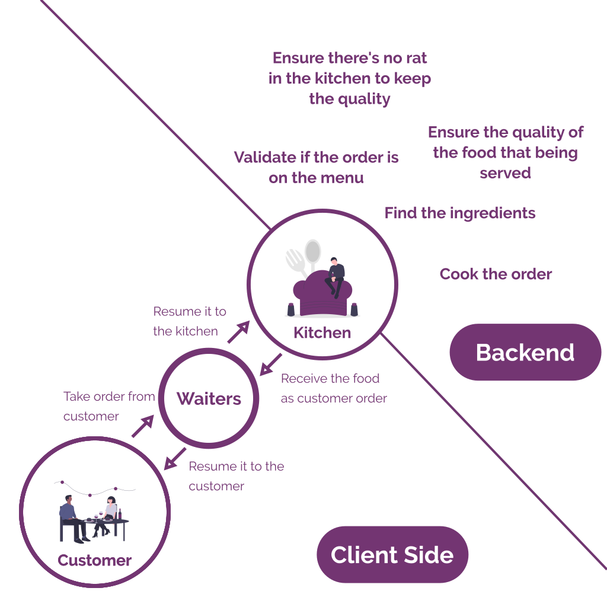
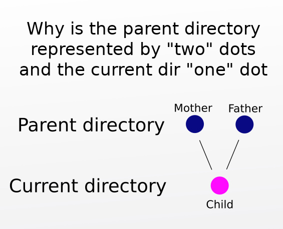

# Backend Introduction #


## Overview ##

Okay,

You've probably have heard what Backend is during the Induction Meeting,
but maybe you didn't understand it well because it was a very quick explaination.

In this material, you'll learn even more about what Backend is. Let's jump into it.

## Goals ##

* You know what backend engineering is
* You know backend's career path
* You know the job description as Backend Engineer
* You know how to use terminal
* You know how to create a hello world application using Node.JS

# Table of Content #
* [Backend Introduction](#backend-introduction)
  * [Overview](#overview)
  * [Goals](#goals)
* [What is Backend?](#what-is-backend)
  * [Analogy](#analogy)
    * [How do we provide the data for the client side?](#how-do-we-provide-the-data-for-the-client-side)
  * [Scopes](#scopes)
    * [Let's sum it up. Here's our scope](#lets-sum-it-up-heres-our-scope)
  * [Career Path](#career-path)
    * [Developer Roadmap](#developer-roadmap)
    * [Backend Roadmap](#backend-roadmap)
* [Terminal](#terminal)
  * [The Hello World](#the-hello-world)
  * [Navigation in Terminal](#navigation-in-terminal)
    * [Change Directory `cd`](#change-directory-cd)
    * [Anoher Mandatory Command](#anoher-mandatory-command)
* [Node.JS](#nodejs)
  * [Uh, but Javascript can run in the Browser, why do we need to install Node.JS?](#uh-but-javascript-can-run-in-the-browser-why-do-we-need-to-install-nodejs)
  * [Run your first node.js command](#run-your-first-nodejs-command)

# What is Backend? #

If you try to google it, you might find this answer in [Quora](https://www.quora.com/What-does-a-backend-engineer-do?share=1).
> Backend engineers are software engineers who work on the server components of multi-tier web applications.  They focus on web services and the data store (data modeling and databases).  They may also be involved with business rule implementation logic. <br> Backend contrasts with frontend which refers to the customer-facing components such as the user interface and interactive client-side functionality (that in a web application typically uses JavaScript (programming language), AJAX, and frameworks such as jQuery.

But, it is too technical. Okay, let me simplify it for you.

## Analogy ##

Let's talk about restaurant.



Based on this analogy, now you've known that your job as a backend is about cook the data and provide the data for the client side.

And you must now Client Side is the guest room in the restaurant, when customer can order the food. Waiter is the part of it.
So, creating Client Side application is Frontend and Mobile's responsibility.

### How do we provide the data for the client side? ###

Good, question.

Our goal as Backend Engineer is to create web service (**Web API**). Client Side will communicate with us via this application. By using HTTP Request or another Internet Protocol. We will talk about this later.

You can see more information about Web API via [this video](https://www.youtube.com/watch?v=s7wmiS2mSXY)

[](https://www.youtube.com/watch?v=s7wmiS2mSXY)

If it doesn't work, [Click Here!](https://www.youtube.com/watch?v=s7wmiS2mSXY)

## Scopes ##

As it said earlier, our job is to make Web API. That's one of our scope.
Web API is being used to connect to the Database. So, maintainig Database and also setting up the database is also our scope.
And also, we have to make our API run as fast as it possible.
Concerning about Web Security is also a part of our job.

### Let's sum it up. Here's our scope ###
* Create Web API
* Maintain Database and everything about Database
* Improve API's performance
* Secure the API

## Career Path ##

There's ton of role that you can land as a Backend Engineer.
Backend Engineer it self is a big job. Because an application is always scaling up.
That means our job will be getting bigger and bigger over the time.
Since we're close to the Server, we will have a specific role to handle the Server and Networking, it is called **DevOps**.
Most of Backend Engineer upgrading themself to become **DevOps**.

This roadmap will cover up your journey as a Backend Engineer

### Developer Roadmap ###


Source: [kamrahmedse/developer-roadmap](https://github.com/kamranahmedse/developer-roadmap#introduction)

### Backend Roadmap ###


Source: [kamrahmedse/backend-roadmap](https://github.com/kamranahmedse/developer-roadmap#back-end-roadmap)

# Terminal #

What is terminal? Terminal is actually a place where you can command your computer directly via text.
Why via text? Because we can use that dynamically.

## The Hello World ##

Now open your terminal, and insert this command to your terminal
```bash
echo "Hello World"
```

It prints out the Hello World to your Terminal. **Yay!**

## Navigation in Terminal ##

When you open your terminal, its location will be on
```bash
/home/yourusername/ # Or it actually just ~
```

It determines your location in the directory. The same way when you open your File Explorer.

In the File Explorer, you can see these folder at the first time open it.
* Documents
* Downloads
* Dekstop
* Music
* Pictures
* Videos

That folder is accessible via terminal.

### Change Directory `cd` ###

It is mentioned, when you open your terminal, by default you're opening the
````bash
/home/yourusername/
````

Let's say you want to move to the **Dekstop** directory. You can just simply run this command.

```bash
cd Dekstop
```

Now, you're on **Dekstop**, how to back in User's Home folder?

```bash
cd .. # You can use this if your parent folder is Home folder
cd ~ # You can use this anywhere, it will direct you to the current user's Home Folder
```

`cd` is a function, and it requires parameter. `~` is parameter, `..` is also a paramter, `Dekstop`, `~/Documents`, '~/path/to/the/darkness` are also a parameter.

But from these paramater, you only need to know these three parameter, because it's static.
* `.` represents current directory that you're currently in.
* `..` represents parent directory of your current directory.
* `~` represents Home Folder of current user

Here's a little meme about it



### Anoher Mandatory Command ###

I won't write the whole command in this Markdown.

You need to learn this:
* `pwd` to show the current path
* `ls` to show list of directory content
* `rm` to remove file/directory
* `mkdir` to create directory
* `touch` to create file
* `cat` to show content of file

[Read more about linux bash command](https://www.pcsuggest.com/basic-linux-commands/)

# Node.JS #

What is Node JS? Well, you've read about it in the installation instruction.
Basically, it is the translator from Javascript to the machine languange, because **Computer doesn't understand Javascript**.

Javascript is a languange, that means, not everything understands Javascript. To make your computer able to speak Javascript, we need to install Node.js.

## Uh, but Javascript can run in the Browser, why do we need to install Node.JS? ##

It only run on Browser, since we're Backend Engineer, we need Node.JS to run Javascript directly on our Machine.

Directly? Since you've installed Node.js, you'll be able to run Node JS inside your terminal. How?

## Run your first node.js command ##

```bash
node -v
```

See the command above? Yes, we can call Node.JS in our terminal. Now, let's make it run our first Javascript Program.

1. Open your text editor (Visual Studio Code)
2. Create new file with `.js` extention
3. Write this code inside your file.
```js
console.log("Hello World!")
```
4. Run that file by using node command.
```bash
node ~/your/file/location.js
```
5. You'll see hello world printed in the terminal

So, that's it for this session!

# References

* [Developer Roadmap](https://roadmap.sh/)
* [Backend Developer Jobs Description](https://www.betterteam.com/back-end-developers-job-description)
* [Basic Linux Terminal](https://maker.pro/linux/tutorial/basic-linux-commands-for-beginners)
* [What is Node.js](https://www.w3schools.com/nodejs/nodejs_intro.asp)
