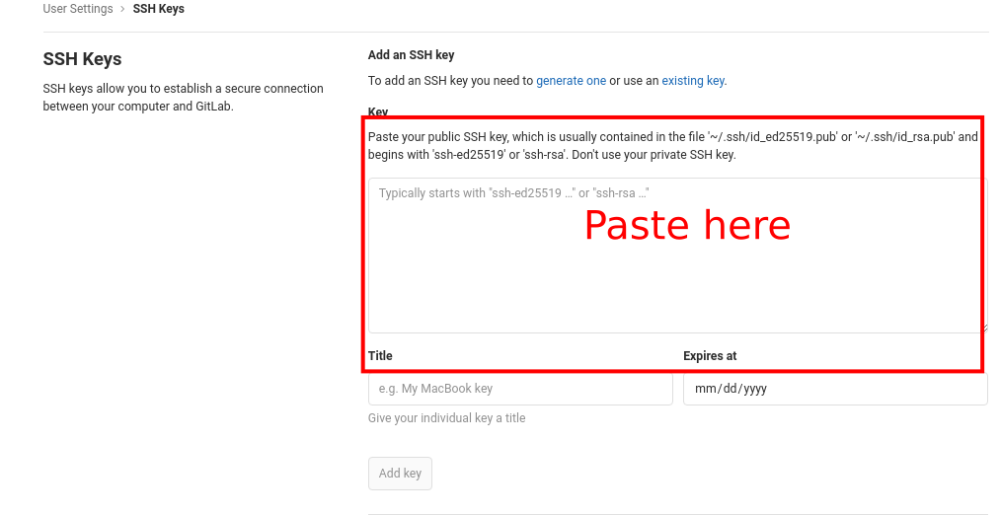

# Overview
In this material, you will learn what Git is, and how it works. Basically, git is just Google Drive to save your source code.

# Goals
* You know what Git is.
* You know what Git Service Provider is.
* You know how to work with Git.
* You know how to solve commit behind on Git.

# Table of Content
- [Overview](#overview)
- [Goals](#goals)
- [Table of Content](#table-of-content)
- [What is Git?](#what-is-git)
  - [How does it work then?](#how-does-it-work-then)
  - [What does Git Service Provider Offer?](#what-does-git-service-provider-offer)
- [Let's get started](#lets-get-started)
  - [Git installation](#git-installation)
  - [Setup your first repository](#setup-your-first-repository)
  - [Tracking any changes in your repository](#tracking-any-changes-in-your-repository)
  - [Commit a Changes](#commit-a-changes)
- [Uploading to Remote repository](#uploading-to-remote-repository)
  - [Gitlab Setup](#gitlab-setup)
    - [Generate SSH KEY](#generate-ssh-key)
    - [Copy the public Key](#copy-the-public-key)
    - [Paste it to Gitlab](#paste-it-to-gitlab)
  - [Create remote repository](#create-remote-repository)
  - [Tell local repository the remote repository address and upload it!](#tell-local-repository-the-remote-repository-address-and-upload-it)
- [Working with branches](#working-with-branches)
  - [Create new branch](#create-new-branch)
  - [Make the feature](#make-the-feature)
  - [Upload it to remote repository](#upload-it-to-remote-repository)
  - [Apply our change to Master Branch via Merge Request](#apply-our-change-to-master-branch-via-merge-request)
  - [Get the update from the remote repository](#get-the-update-from-the-remote-repository)
- [Useful Link](#useful-link)

# What is Git?
Git is a version manager, that will manage your project source code. That means, you can work with another people for your project and it will prevent you to face some conflicts during the development. And it all can be done in your Computer (Terminal). Your source code will be called as **Repository**.

Git also useful to track any changes that happened inside your repository, so it will be way more easier to find the source of problem when you're looking for that, and it even it will help you undo your work better if it's needed.

## How does it work then?
To be able to work remotely and collaboratively we need Git Service Provider. For example:
* [Github](https://github.com/)
* [Gitlab](https://gitlab.com/)
* [Bitbucket](https://bitbucket.org/)

## What does Git Service Provider Offer?
It offers a service to save your Project's Source Code inside that, and will allow you to collaborate with another developer. Just like Google Drive, but instead of saving Documents, Pictures, etc. We save our Project's Source Code. And repository inside the Git Service were called as **Remote Repository**, just like our Drive in Google Drive.

# Let's get started
In order to run Git in our computer, we need to install it first.

## Git installation
To install git, you just need to type this inside your terminal
```bash
sudo apt install git
```
Wait until it's done, then it's done.

## Setup your first repository
To create a repository, you only need to have a Folder, that will be your Source Code. Navigate to there, and run this command
```bash
git init
```

## Tracking any changes in your repository
To track a change in your repository, you only need to make a change inside that. Follow this steps:
1. Create a file, random file.
   ```bash
   touch hello.js
   ```
2. Check if the file is already tracked by Git.
   ```bash
   git status
   ```
3. And the output should be like this
   ```bash
   On branch master

   No commits yet

   Untracked files:
   (use "git add <file>..." to include in what will be committed)

   hello.js

   nothing added to commit but untracked files present (use "git add" to track)
   ```

That means, your changes has been tracked to the git.

## Commit a Changes
When we made a change, we have to commit them if we want to apply that changes in our **Remote Repository**. Apply the changes it means that we will upload the changes to the remote repository. It is just like when we upload our folder to the Google Drive.

1. Check if there's a change to commit.
   ```bash
   git status
   ```
2. If there's a change then we run this command
   ```bash
   git add .
   ```
   What it does? It will add every changes that you made inside your local repository.

3. After you've done with adding the necessary changes, just run this command
   ```bash
   git commit -m "[YourName] Your Commit Message, determines your changes"
   ```

# Uploading to Remote repository
Now, you've done adding the changes in the local repository, but how do we upload it to the remote repository, so the other developer will have our changes in their repository as well?

## Gitlab Setup
In order to upload your repository easily, you need to setup an **SSH Key**.
How do we do that?

### Generate SSH KEY

```bash
ssh-keygen -t rsa -b 2048 -C "email@example.com"
```
And then just press enter until it's done!

Those code, will generate a new SSH Key pair for you, and what you have to do right now is copy the public key and paste it to Gitlab.

### Copy the public Key
This is how you copy the public key
```bash
cat ~/.ssh/id_rsa.pub
```
Copy the result by select that text and then press `CTRL + SHIFT + C`

### Paste it to Gitlab
Where do we paste that key in Gitlab?
1. Navigate to Profile Section
   
   

   Then choose, `Settings`

2. Open SSH Keys Tabs
   
   

3. Paste the SSH Keys then press `Add Key`
   
   

If you're still confused then, hit this [link](https://gitlab.com/help/ssh/README#generating-a-new-ssh-key-pair)

## Create remote repository
If you haven't had a remote repository, than probably you should create one, how to create it?
1. Navigate to Gitlab (or another service)
2. Create new project

   

3. Fill in the necessity fields. Never check the *Initialize repository with a README*!
   
   

## Tell local repository the remote repository address and upload it!

Now you have the remote repository, how do we link that to our local repository that already been exist?

Well, when you create a new project, Gitlab will tell you how to link your local repository to the Gitlab.


Follow the **Git Global Setup** Tutorial, and **Push an existing folder**

# Working with branches
Currently, you're only working with a single branch called `master`, that was why when you run `git push`, there's additional command called `origin master`, it means that we want to upload it to the master branch on the remote repository.

Well, it is not a good practice, tho. When we're working on a project, it is strictly forbidden to push our code directly to the master, because master is where our application lived for the user.

In order, to solve that we need to work on a different branch and create a **Merge Request** when we want to apply our changes to the master branch.

## Create new branch
The branch name should follow this convention `feature/what_you_are_working_on`. So now, let's go ahead creating a new branch by running this command:
```bash
git checkout -b feature/hello_world
```

When we run this, command, it will create a new branch from master, it means that our "whatever branch" names will have the same content as master, just like copy and paste our master branch to another folder.

## Make the feature
Let's say, we want to add more feature on our `hello.js` file. That file will say `Hello World` on terminal when it runs.

So, let's make that feature. Add this code to you `hello.js` file.
```javascript
console.log("Hello World")
```

Then, make sure it runs
```bash
node hello.js
# Output: Hello World
```

## Upload it to remote repository
To upload the changes, just like [Tell local repository the remote repository address and upload it!](#tell-local-repository-the-remote-repository-address-and-upload-it)

But we need to do this a little bit different.
1. Commit the changes
2. Push it to your new branch in the remote repository
   ```bash
   git push origin feature/what_you_are_working_on
   ```
3. Then it is uploaded

## Apply our change to Master Branch via Merge Request
Navigate to your repository link. Then go ahead open the Merge Request Tab.

1. Open the Merge Request Tab
   
   

2. Create new merge request
   
   

3. Submit the MR
   
   

   Make sure your target branch is correct, in some case you may want to choose the `develop` as your target branch. If it's not as what you intended to do, then just change the branch.

   

4. Merge it!
   
   After you confident enough to merge the changes, then just hit Merge Button!

   

5. Then open your master branch in the remote repository, you'll see your update there.

## Get the update from the remote repository
When somebody did Merge Request, and that MR has already been approved, then the remote repository of the target branch of that MR will be updated. So, our branch will be behind from that update. 

To get that update we can just simply run this command:
```
git pull origin <branch_name>

# For Example
git pull origin master # To get the master branch update
```

This will solve a lot of problem. You may encounter such as `Your branch is n commits behind from master` when you create a new merge request, to solve that problem, all you need to do is just run that command and push it again to your branch.


# Useful Link
1. [Introduction to Git](https://www.freecodecamp.org/news/what-is-git-and-how-to-use-it-c341b049ae61/)
2. [Watch The Playlist](https://www.youtube.com/watch?v=Jt4Z1vwtXT0&list=PLhW3qG5bs-L8YSnCiyQ-jD8XfHC2W1NL_)
3. [Try it!](https://codesaya.com/git/berkenalan-dengan-git/apa-itu-version-control/unit/1/)
4. [Git Ga Pake Ribet!](https://rogerdudler.github.io/git-guide/index.id.html)