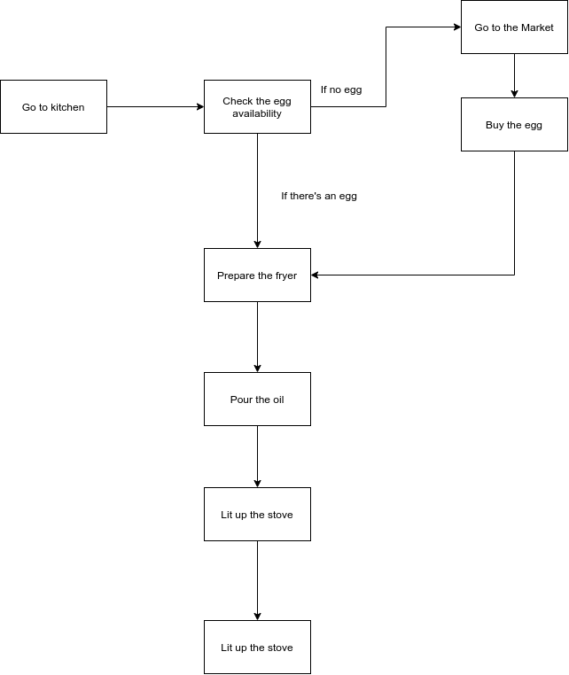

# Overview

What is logic flow? When you try to do something, you must breakdown the things in order to make it clear while you execute it. And it usually called as Algorithm.

Algorithm is basically just a step-by-step to achieve something.

Let's say you want to cook an egg

1. You go the the kitchen
2. Get the egg
3. Check the egg
   * If the egg doesn't exist
      * Buy an egg
      * Go to the market
   * If the egg exist, then just go ahead to the next steps
4. Pour the oil inside your fryer
5. Lit up your stove
6. Wait until the oil's getting hot
7. Break your egg and cook it until it's cooked

# Goals
* You know how to draw logic flow
* You know how it will be executed

# Logic Flow

Let's talk about "How to cook an egg" algorithm, if we draw the logic it should be like this.



You've seen the chart, now write the code.

## Impelementation

You'll have the fridge variable that will contains an array of your fridge content.

```js
let fridge = [
  "Apple",
  "Wortel",
  "Milk",
  "Orange",
  "Leech",
  "Cabbage"
]

function checkTheEggAvailability() {
  console.clear();
  console.log("Checking the egg availability...")

  // Check the egg availability
  for (let i = 0; i < fridge.length; i++) {
    if (fridge[i] == "Egg") {
      console.log("There's an egg")
      return false
    }
  }

  // If we complete the loop and there's no egg
  console.log("There's no egg")
  return true
}

// Function to handle if we have to go to market or not
function goToTheMarket(shouldWe) {
  if (shouldWe) {
    console.log("Heading to the market");
    console.log("Buying an egg");
  }
}

// Function to prepare the fry
function prepareTheFry() {
  console.log("Pouring the oil");
  console.log("Lit up the stove");
}

// Fry the egg
function fryTheEgg() {
  console.log("Cook the egg");
}

// Go to kitchen and check the fridge
function cookAnEgg() {
  // Check if the egg is available
  let shouldWeGoToTheMarket = checkTheEggAvailability();
  
  // Check if we should go to the market or not
  goToTheMarket(shouldWeGoToTheMarket);
  prepareTheFry()
  fryTheEgg();
}

cookAnEgg()
```

## Bonus

In real life, it takes time to do that logic, so let's make it a little bit realistic with Async Function in Javascript.

Don't worry, you don't need to know about this yet!

```javascript
const sleep = ms => {
  return new Promise(
    resolve => setTimeout(resolve, ms)
  )
}

let fridge = [
  "Apple",
  "Wortel",
  "Milk",
  "Orange",
  "Leech",
  "Cabbage"
]

// To randomly set the egg availability
if (Math.floor(Math.random() * 1) == 1) {
  fridge.push("Egg");
}

function checkTheEggAvailability() {
  return new Promise(async resolve => {
    console.clear();
    console.log("Checking the egg availability...")
    await sleep(2000);
  
    // Check the egg availability
    for (let i = 0; i < fridge.length; i++) {
      if (fridge[i] == "Egg") {
        console.log("There's an egg!")
        resolve(false)
      }
    }
  
    // If we complete the loop and there's no egg
    console.log("There's no egg!")
    await sleep(1000);
    resolve(true)
  })
}

// Function to handle if we have to go to market or not
async function goToTheMarket(shouldWe) {
  if (shouldWe) {
    console.clear();
    console.log("Heading to the market...");
    await sleep(4000);
    console.log("Buying an egg...");
    await sleep(1000);
  }
}

// Function to prepare the fry
async function prepareTheFry() {
  console.clear();
  console.log("Pouring the oil...");
  await sleep(1000);
  
  console.clear();
  console.log("Lit up the stove...");
  await sleep(1000);
}

// Fry the egg
function fryTheEgg() {
  return new Promise(resolve => {
    console.clear();
    console.log("Cook the egg...");
    sleep(4000).then(() => {
      console.clear();
      resolve("Egg is ready to eat!")
    })
  })
}

// Go to kitchen and check the fridge
async function cookAnEgg() {
  // Check if the egg is available
  let shouldWeGoToTheMarket = await checkTheEggAvailability();
  
  // Check if we should go to the market or not
  await goToTheMarket(shouldWeGoToTheMarket);
  await prepareTheFry()

  console.log(
    await fryTheEgg()
  );
}

cookAnEgg()
```